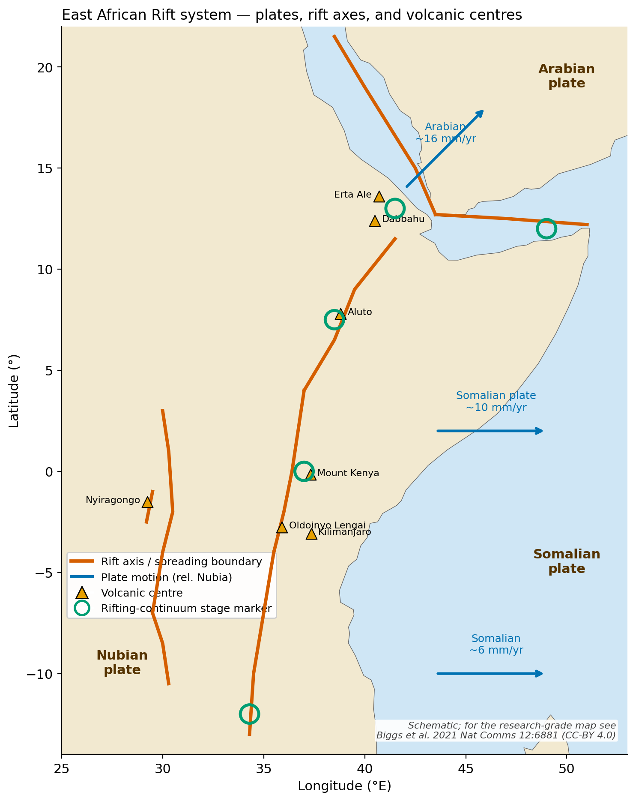
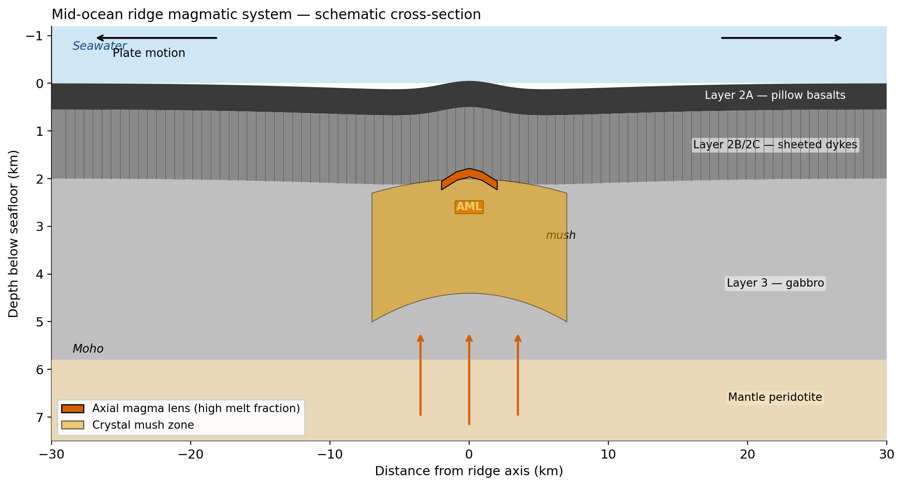
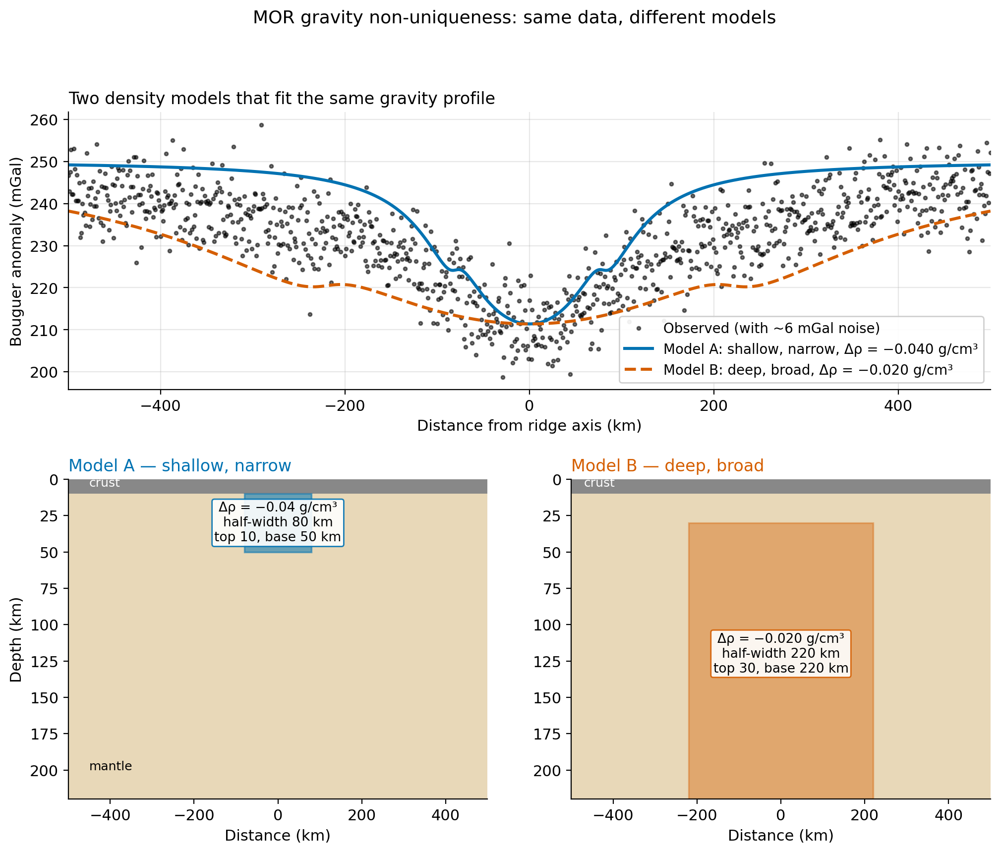
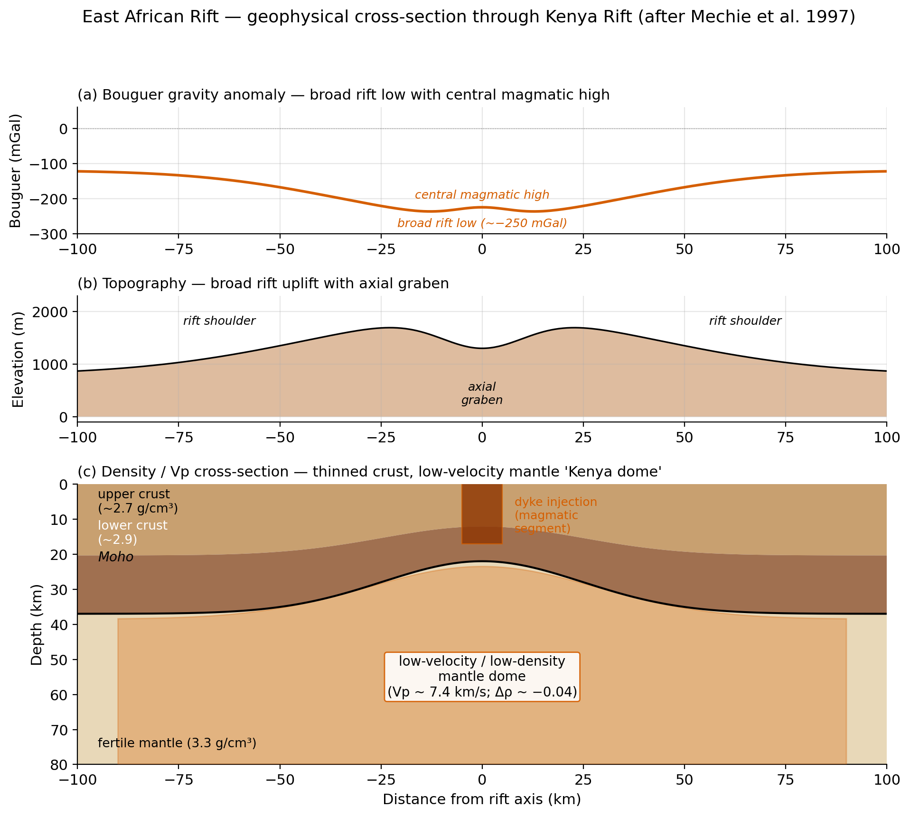
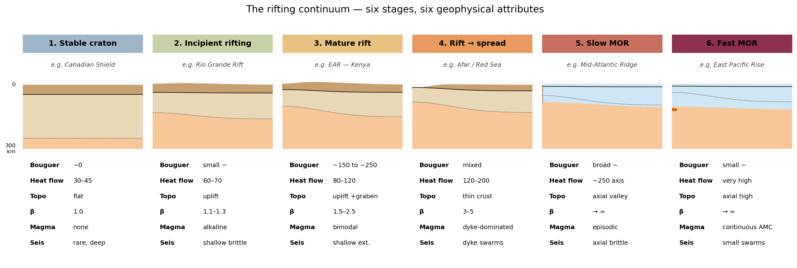

<!-- _class: title -->

# Ridges and Rifts

### ESS 314 — Lecture 27

#### Module 7: Tectonics, Lithosphere, and the Cooling Earth

University of Washington · Earth & Space Sciences

---

## By the end of this lecture, you will be able to…

- Articulate the **rifting continuum** from stable craton through mature rift, magmatic break-up, and mid-ocean ridge — and identify the diagnostic geophysical signature of each stage.
- **Invert a spreading rate** from a magnetic-anomaly profile using the Geomagnetic Polarity Time Scale and `scipy.signal.find_peaks`.
- Decompose a continental-rift Bouguer anomaly into **topography + Moho + LAB** contributions.
- Demonstrate **gravity non-uniqueness** at a mid-ocean ridge and identify the additional observables that disambiguate.
- Evaluate failure modes of **autonomous stripe picking** as an AI-as-Tool case study.

---

## The geoscientific question

> *Mid-ocean ridges and continental rifts both extend the lithosphere. Why do they look so different in gravity, heat flow, and magnetics — and how do we know they are the same physical process?*

- Ridge: submarine mountain chain, basaltic crust, dense, recycling on Myr timescales.
- Rift: continental depression, faulted, alkaline volcanism, sediment-filled.
- **Same physical process** — extension — produces both.
- The **East African Rift** preserves every stage in between.

---

## The East African Rift system



Spatially samples stages 2–6: Malawi (incipient) → Kenya (mature) → Afar (break-up) → Red Sea / Gulf of Aden (spreading).

---

## Governing physics: extension and the stretching factor

- **Stretching factor** $\beta = L_0 / L_{\text{thinned}}$.
- Stable craton: $\beta = 1$.
- Mature continental rift: $\beta = 2$–$3$.
- Magmatic break-up: $\beta = 4$–$6$.
- Mid-ocean ridge: $\beta \to \infty$ (original lithosphere fully replaced).
- Same physics. Different stage. Different geophysical signature.

---

## The ridge magmatic system



Axial melt lens (AML) at 1.5–3 km depth — broader crystal mush zone below — sheeted dykes and pillow basalts above.

---

## Magnetic stripes record spreading

Vine–Matthews–Morley:
- New oceanic crust acquires thermal remanent magnetisation at the ridge axis as it cools through the Curie point.
- The geomagnetic field reverses irregularly — the **GPTS** (Cande & Kent 1995) catalogues reversals back to ~180 Ma.
- Symmetric polarity bands either side of the axis record the reversal history.

$$
r = \frac{d_n - d_m}{t_n - t_m}
$$

The simplest inverse problem in geophysics.

---

## Ridge gravity and the mantle root

- **Free-air** anomaly $\approx 0$: ridge is isostatically compensated.
- **Bouguer** anomaly **strongly negative** ($-250$ mGal): low-density mantle root.
- The Bouguer reduction strips out the *topography* but leaves subsurface density contrasts.
- The mantle root — partially molten + thermally expanded — is the dominant signal.

The Bouguer signature is *opposite* to what naive intuition predicts.

---

## MAR gravity profile — three views


Topography + gravity + density model. The mantle root (orange) drives the Bouguer signature.

---

<!-- _class: section -->

# Round 1 — Predict

A clean Bouguer profile across a mid-ocean ridge.

- Amplitude: $\approx -250$ mGal at axis.
- Half-width: $\approx 200$ km.

**Sketch a 2D density-anomaly cross-section that fits.**

You choose depth, width, and density contrast. 4 minutes.

---

## Round 1 — Reveal



Both fit within data uncertainty. Amplitude is constrained; **depth, width, density are not**.

---

## Round 1 — Discuss

- What is the **geological interpretation** of each model?
- Which **additional observable** would disambiguate?
  - Seismic $V_p$ tomography? Heat flow? Mantle Bouguer anomaly?
  - All three together?
- The pattern: **single-method inversions are non-unique**. Multi-method synthesis is the resolution.

Connects forward to L29 (focal mechanisms + GPS) and L30 (joint inversion).

---

## McKenzie 1978 stretching → subsidence

- **Syn-rift subsidence:** $S_i = a \frac{\rho_m \alpha T_m (1 - 1/\beta)}{\rho_m - \rho_s}$ — instantaneous.
- **Post-rift thermal subsidence:** lithosphere re-thickens by conduction; $\sqrt{t}$ behaviour. Thermal time-scale $\tau \approx 62$ Myr.
- **Steer's-head basin:** narrow syn-rift + broad post-rift = every passive margin on Earth.

Same heat equation as half-space cooling (L26).

---

## Continental-rift Bouguer decomposition


LAB thinning dominates; Moho relief partially cancels; topography modulates near axis.

---

## EAR Kenya cross-section



Mature rift signature: broad uplift + axial graben + thinned crust (Moho 22 km) + mantle dome.

---

## Three rifts, three stages


Active broad low (B&R) → mature rift with magmatic high (EAR) → failed rift with central gabbroic high (Keweenawan).

---

## CONUS Bouguer gravity


Western lows (active extension) — Midcontinent Rift high (failed) — Appalachian low (orogenic root). After USGS FS 78-95 (public domain).

---

<!-- _class: section -->

# §4 — Code Block D: spreading rate from magnetic stripes

```python
import xarray as xr
import numpy as np
from scipy.signal import find_peaks

url = "https://www.ngdc.noaa.gov/geomag/EMAG2/EMAG2_V3_20170530.nc"
emag = xr.open_dataset(url)
profile = emag["z"].sel(lat=47.0, method="nearest").sel(lon=slice(-132, -126))
distances_km = (profile.lon - (-129.0)) * 111 * np.cos(np.radians(47))

peaks, _ = find_peaks(profile.values, prominence=80, distance=20)
# Match to GPTS (Cande & Kent 1995); fit slope through origin.
```

The fourth canonical data-access block of the course.

---

## JdF Ridge — stripes and inversion


Find peaks → match to GPTS → linear fit → spreading rate. One line, in principle.

---

<!-- _class: section -->

# Round 2 — Predict, then reveal the rifting continuum

Six stages: stable craton → incipient → mature → break-up → slow MOR → fast MOR.
For each, predict sign + magnitude of: Bouguer · heat flow · topography · $\beta$ · magma · seismicity. **5 minutes.**



Same six observables, six qualitatively different signatures. EAR spatially preserves stages 2–4.

---

## Slow vs. fast ridges


Trend after Bell et al. 2022 (CC-BY 4.0): fast → shallow continuous AMC; slow → deep, episodic.

---

## PNW connection: Juan de Fuca + Axial Seamount

- **JdF Ridge** sits 250 km off the Washington and Oregon coast.
- The plate it creates is the same one that subducts under Cascadia.
- **Axial Seamount** = ridge + Cobb hotspot interaction.
- Continuously monitored since 2014 by the **OOI Regional Cabled Array** — the only fully cabled MOR observatory in the world.
- Erupted in 2015 — the only MOR eruption ever recorded by a real-time cabled network.

Cascadia = ridge offshore + trench onshore + arc through the city. Drive distance from Seattle.

---

## AI as a Tool — autonomous stripe picking

- `scipy.signal.find_peaks` succeeds in the **data-rich middle**: clean profiles, strong signal, smoothly varying noise.
- It **fails** at the magnetic equator (weak induced field), at slow ridges with rough basement topography, near the poles (interfering geology), and under thick sediment cover (low-pass filtered signal).
- A deep-learning picker (Galloway 2024) does better on noisy data but **inherits the same physical failure modes**.

You must know enough geophysics to recognise when the tool will lie.

---

## Research horizon (open access)

- **Bell et al. 2022** (Frontiers, CC-BY) — modern review of MOR magma chamber and crystal mush imaging. Database of 277 imaging studies.
- **Biggs et al. 2021** (Nat Comms, CC-BY) — comprehensive synthesis of volcanic activity and hazard in the East African Rift.
- **La Rosa et al. 2025** (Solid Earth, CC-BY) — Afar rift strain partitioning between faulting and dyke intrusion.

**Open question:** Why do some continental rifts break to spreading and others fail?

---

## Concept checks

1. **Spreading rate**: C5 chron (10.95 Ma) at 410 km from axis. What is the half-rate? Slow, intermediate, or fast?
2. **Disambiguation**: Round 1 Bouguer profile + one extra measurement. Heat flow, $V_p$ tomography, or magnetics? Justify.
3. **Stage**: Rio Grande Rift — $\beta = 1.2$, heat flow 80 mW/m², Bouguer −100 mGal. Which continuum stage?
4. **AI failure**: 12 peaks per side, only 4 expected, slow Reykjanes Ridge. Diagnose two failure modes.

See you next time for L28: convergent margins.
