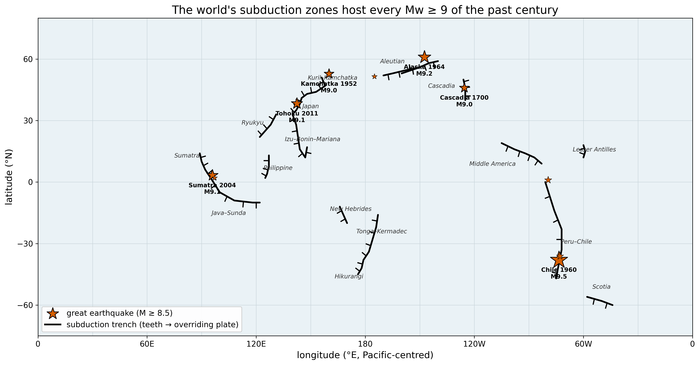
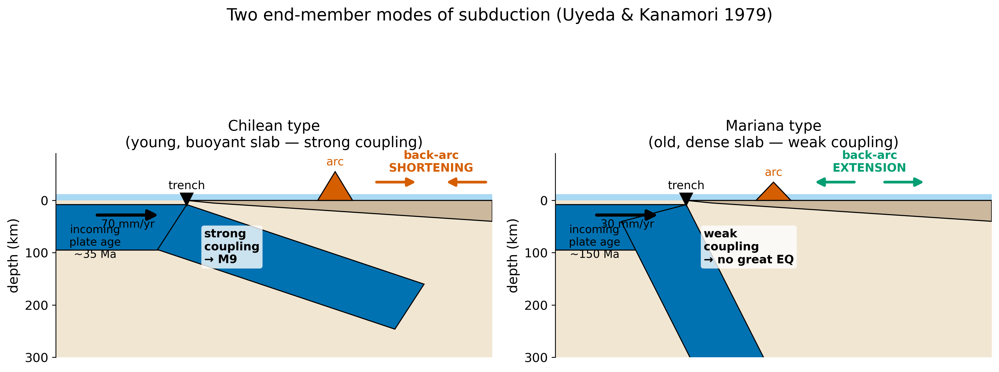
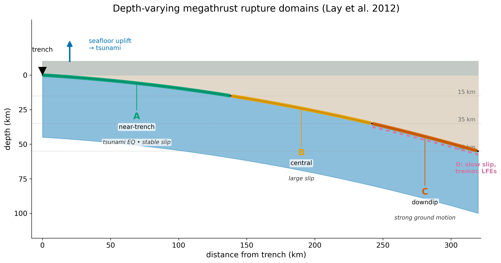
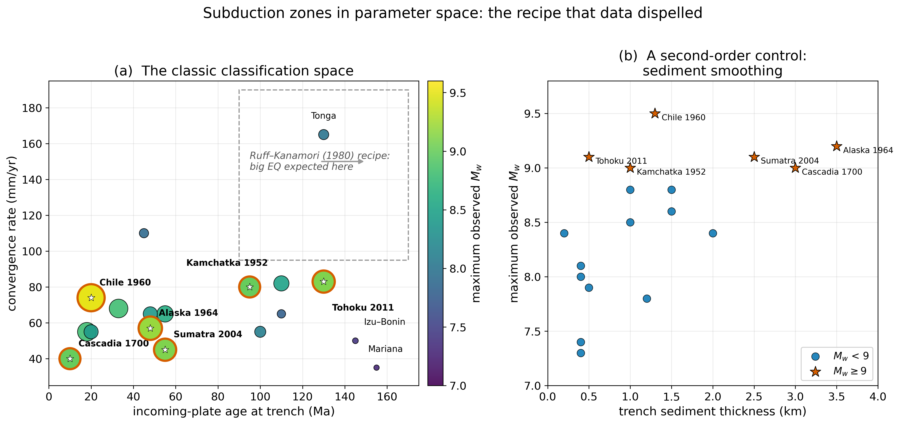
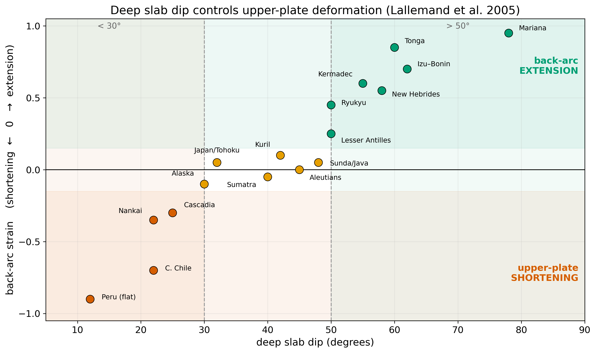
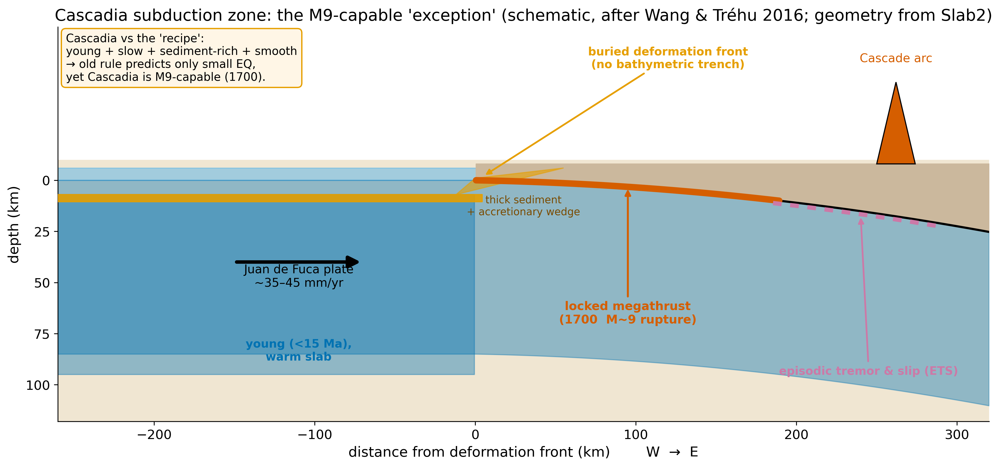

<!-- _class: lead -->
<!-- _paginate: false -->
<!-- _footer: "" -->

# Convergent Plate Boundaries

## Subduction & Collision

### ESS 314 · Geophysics · Lecture 28

Marine Denolle — University of Washington

---

## By the end of this lecture

- **Describe** subduction-zone anatomy and the Chilean ↔ Mariana continuum
- **Use** age, rate, and sediment to classify a margin — and test the maximum-magnitude hypothesis
- **Interpret** the depth-varying rupture domains (seismicity, tsunami, strong motion)
- **Explain** why young, slow Cascadia is nonetheless $M\,9$-capable

---

## Subduction zones host every $M\,9$

Takeaway — Every great earthquake is on a megathrust — but the giants scatter across margins of *very different* age and rate.

---

## A rule that data dispelled

- **Ruff–Kanamori (1980):** old + fast ⇒ strong coupling ⇒ great earthquakes
- **Sumatra 2004** (old, *slow*) → $M\,9.1$
- **Tōhoku 2011** (where $M\,9$ was thought "impossible") → $M\,9.1$
- **Age and convergence rate do *not* set the maximum magnitude**

> *What controls how large a subduction earthquake can be — and why were the obvious parameters wrong?*

---

## The slab is a cold, dense sinker

- Cold, thick, old lithosphere → **negative buoyancy**
- Basalt → eclogite transition adds density at depth
- **Slab pull** is the dominant plate-driving force
- This is *why* old slabs looked like the big-quake recipe

---

## Two end-member modes

Takeaway — Coupling and dip set the style: **Chilean** (shallow, coupled, shortening) ↔ **Mariana** (steep, weak, extension).

---

## The thermal parameter

$$ \Phi = A \, v_c \, \sin\delta $$

- Combines age $A$, convergence rate $v_c$, and dip $\delta$
- A measure of **how cold the slab stays** as it descends
- Large $\Phi$ → deep seismicity, the "strong-coupling" expectation
- Hold onto it — the data will test it

---

## What limits the largest earthquake?

$$ M_0 = \mu\,\bar{D}\,(L\,W), \qquad M_w = \tfrac{2}{3}\log_{10} M_0 - 6.07 $$

- Maximum magnitude is set by rupture **area** ($L \times W$), not slab age
- Wide + long + strongly locked ⇒ great earthquake
- **The controls are geometric**

---

## Depth-varying rupture domains

Takeaway — Shallow domain **A** → tsunami; downdip domain **C** → strong ground motion. A margin's hazard depends on which domains it has.

---

## The recipe, tested against data

Takeaway — Age & rate (top) don't order $M_w$; seismogenic **width** ($r{=}0.44$) & **flatness** ($r{=}0.42$) do (Wirth 2022).

---

## What actually controls $M_{\max}$

- **Seismogenic width & dip** — strongest; $M{\geq}8.5$ needs width $>75$ km, $M{\geq}9.2$ needs $>150$ km
- **Downdip curvature** — flat megathrusts rupture biggest
- **Secondary:** sediment smoothing, roughness, fluids, upper-plate strain
- **Working assumption: any mature megathrust may be $M\,9$**

---

## Dip controls the back-arc

Takeaway — Steep dip ($>50^\circ$) → back-arc **extension**; shallow dip ($<30^\circ$) → upper-plate **shortening**.

---

## Three margins, three verdicts

- **Chile** — old-ish, fast, coupled → recipe works ($M\,9.5$ in 1960)
- **Mariana** — very old *but* steep, narrow zone → **no great EQ**
- **Cascadia** — young, slow → recipe says "small"... yet $M\,9$ (1700)
- One scheme can't fit all three ⇒ **the controls were wrong**

---

## Cascadia: the $M\,9$-capable exception

Takeaway — Young, warm, slow, sediment-rich, smooth — yet locked, and it ruptured $M\sim 9$ in January 1700.

---

## Zooming out: the convergence spectrum

Takeaway — Buoyancy of the incoming material sets the mode: ocean subducts; arcs & continents **collide** (Taiwan, Himalaya).

---

## AI literacy — the confident, outdated answer

- Ask an AI: *"how do age and rate set the maximum subduction earthquake?"*
- It may recite the **dispelled** 1980 rule — fluently and confidently
- **Grade it:** Does it cite Sumatra / Tōhoku? Does it give the modern controls?
- **You catch this with domain knowledge, not better prompting**

---

## Concept check

1. Compute $\Phi$ for Tōhoku vs. Mariana — which slab is colder? Which is bigger?
2. Rupture area and length for $M_w\,9$ ($\mu = 40$ GPa, $\bar{D} = 15$ m, $W = 100$ km)?
3. Name two "high-recipe" margins with no great earthquake — why not?
4. Why is Cascadia regarded as $M\,9$-capable? Cite two second-order controls.

*Interactive classification: `notebooks/subduction_parameter_space.ipynb`*

---

<!-- _class: lead -->
<!-- _footer: "" -->

## Next: Transforms & Intraplate (L29)

the third boundary class — and where the rigid-plate assumption **breaks**
