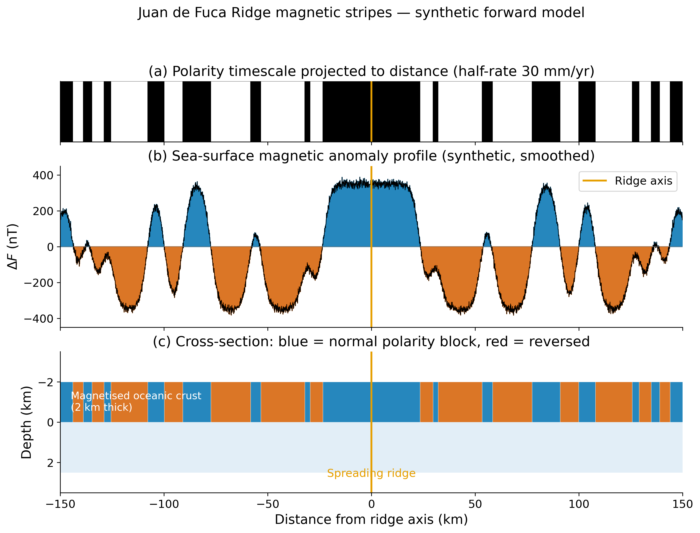
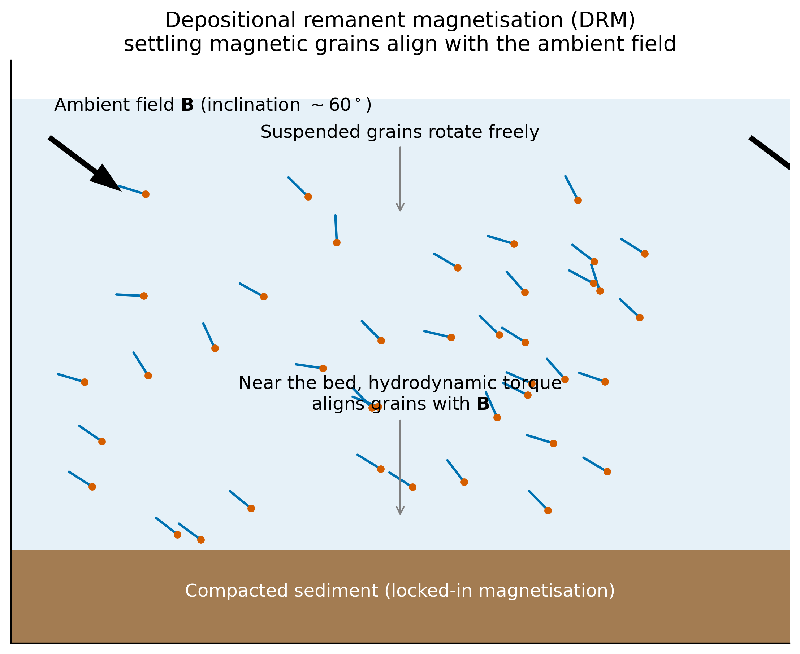
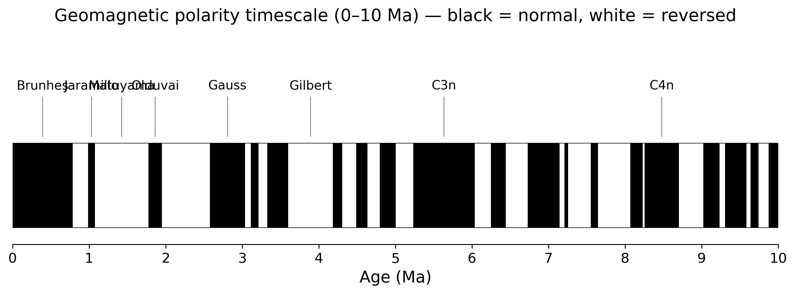

<!-- _class: title -->

# Lecture 24
## Rock Magnetism
### How rocks remember the field that made them

ESS 314 · Spring 2026 · Marine Denolle

---

## 1. The framing question

> *"If the spreading floor hypothesis is correct, then normally magnetised blocks alternate with reversely magnetised blocks…"*
> — Vine & Matthews, **Nature** (1963)

- Ship-towed magnetometer profiles across the Juan de Fuca Ridge show **alternating stripes** of high and low magnetic intensity, symmetric about the ridge axis.
- A pattern this clean requires that newly-formed basalt **records the field at the moment it cools** and keeps that record for millions of years.
- *What atomic-scale physics turns a rock into a magnetic tape recorder?*

*Read more → [Lecture 24 §1](../lectures/24_rock_magnetism.html#1-the-framing-question)*

---

## Synthetic Juan de Fuca stripes

- Half-rate 30 mm yr⁻¹ converts polarity timescale → distance.
- Smoothed ΔF profile reaches **±350 nT** with FWHM ≈ 6 km.
- Crustal cross-section: blue blocks = normal-polarity TRM, red = reversed.

---

## Learning objectives

By the end of today, students will be able to:

1. Classify minerals into the **five magnetic-ordering categories** and predict $\chi$ and $Q$.
2. Distinguish **induced** from **remanent** magnetisation and compute the **Königsberger ratio** $Q = M_r / (\chi H)$.
3. Identify the three principal acquisition mechanisms — **TRM, DRM, CRM** — and the rocks that carry them.
4. Read a **geomagnetic polarity timescale (GPTS)** ribbon and convert chron ages to seafloor distance.
5. Use the **Siletzia** post-Eocene rotation as a worked example of inverting paleomagnetic vectors for tectonic motion.

---

## 2. Magnetic ordering at the mineral scale

- The constitutive law $\mathbf{M} = \chi \mathbf{H}$ hides a factor of **10⁵** between minerals.
- Five categories of electron-spin alignment:
  - **Diamagnetic** (calcite, quartz): $\chi < 0$
  - **Paramagnetic** (olivine, pyroxene): $\chi > 0$, small
  - **Ferromagnetic** (rare in nature: native Fe)
  - **Ferrimagnetic** (magnetite, pyrrhotite): large $M_r$
  - **Antiferromagnetic / canted** (hematite): small but stable $M_r$

*Read more → [Lecture 24 §2](../lectures/24_rock_magnetism.html#2-magnetic-ordering-at-the-mineral-scale)*

---

## Curie temperatures of common carriers

| Mineral | $T_C$ (°C) | Carrier | PNW context |
|---|---:|---|---|
| Magnetite (Fe₃O₄) | 580 | TRM | Cascade basalts, Crescent Fm. |
| Titanomagnetite | 150–580 | TRM | Young MORB, JdF Ridge |
| Hematite (αFe₂O₃) | 680 | CRM | Eastern Washington red beds |
| Pyrrhotite (Fe₇S₈) | 320 | TRM/CRM | Hydrothermal veins |
| Goethite | 120 | CRM | Soils, weathered crust |

---

## 3. Induced vs. remanent magnetisation

- **Induced**: $\mathbf{M}_i = \chi \mathbf{H}$, **disappears when $H \to 0$**.
- **Remanent**: $\mathbf{M}_r$ persists with no external field — locked in at formation.
- **Königsberger ratio** $Q = M_r / (\chi H_{\rm Earth})$:
  - $Q \ll 1$ — magnetisation tracks today's field
  - $Q \gg 1$ — magnetisation records the *paleofield*
- $Q$ for fresh MORB ≈ **5–50**; for granite ≈ **0.1–1**.

*Read more → [Lecture 24 §3](../lectures/24_rock_magnetism.html#3-induced-versus-remanent-magnetisation)*

---

## 4. A rock is an ensemble of grains

- Bulk $\mathbf{M}$ = vector sum over millions of grains.
- **Single-domain** grains (≲ 0.1 μm) carry the most stable remanence.
- **Multi-domain** grains lose memory through domain-wall motion.
- Stability ↑ as grain volume ↑ and temperature ↓ — captured by **Néel relaxation time**:
  $$\tau = \tau_0 \exp\!\left(\frac{K V}{k_B T}\right)$$

*Read more → [Lecture 24 §4](../lectures/24_rock_magnetism.html#4-a-rock-is-an-ensemble-of-grains)*

---

## 5a. TRM — thermoremanent magnetisation

- Lava erupts at ~1100 °C — well above $T_C$. Spins are randomly oriented.
- As cooling crosses $T_C$ (e.g. 580 °C for magnetite), spins align with the **ambient field at that instant**.
- Below the **blocking temperature** $T_B < T_C$, that alignment is locked for $\gtrsim 10^9$ yr.
- **TRM is what records the polarity timescale on the seafloor.**

*Read more → [Lecture 24 §5a](../lectures/24_rock_magnetism.html#5a-thermoremanent-magnetisation-trm)*

---

## 5b. DRM — depositional remanence

- Detrital magnetic grains settle through a water column with the ambient field acting as a weak torque.
- Hydrodynamic and biological forces leave a **biased alignment** preserved at the sediment–water interface.
- DRM is typically **10×–100× weaker** than TRM but covers the long sedimentary record (deep-sea cores, lakes).

*Read more → [Lecture 24 §5b](../lectures/24_rock_magnetism.html#5b-depositional-remanent-magnetisation-drm)*

---

## 5c. CRM — chemical remanence

- New magnetic minerals grow during weathering, diagenesis, or hydrothermal alteration.
- As grain volume exceeds the **superparamagnetic threshold**, the field at that moment is locked in.
- CRM records **secondary** events, not the original cooling age — a source of *paleomagnetic noise* unless cleaned by thermal/AF demagnetisation.

*Read more → [Lecture 24 §5c](../lectures/24_rock_magnetism.html#5c-chemical-remanent-magnetisation-crm)*

---

## 6. The geomagnetic polarity timescale

- The field reverses on irregular timescales (10⁴ – 10⁶ yr).
- The last reversal (**Matuyama → Brunhes**) was **781 ka**.
- The GPTS, built from ocean stripes + radiometric dating, is the **master clock** for Cenozoic tectonics.

*Read more → [Lecture 24 §6](../lectures/24_rock_magnetism.html#6-the-geomagnetic-polarity-timescale-gpts)*

---

## 7. Forward model — Vine-Matthews-Morley

- New crust at the ridge cools through $T_C$ → records the **current** polarity.
- Spreading at half-rate $u$ carries that crust laterally.
- Distance from ridge $x = u \cdot t$ ↔ polarity-stripe age.
- For JdF half-rate $u \approx 30$ mm yr⁻¹: the 781 ka Brunhes/Matuyama boundary sits at $x \approx 23$ km from the ridge — exactly where the field measurement shows the first reversal.

*Read more → [Lecture 24 §7](../lectures/24_rock_magnetism.html#7-forward-modelling-the-ridge-stripe-pattern)*

---

## 8. Cascadia worked example — Siletzia rotation

- The Eocene Crescent Formation (Olympic Peninsula, Willapa Hills) carries a **TRM** locked in ~50 Ma.
- Measured paleomagnetic inclination → paleolatitude **agrees** with today's.
- Measured **declination** is rotated **~50° clockwise** from north.
- *Inverse*: Siletzia (the accreted oceanic plateau under western WA / OR) has **rotated clockwise** since accretion — consistent with GPS-tracked block rotations today.

*Read more → [Lecture 24 §8](../lectures/24_rock_magnetism.html#8-inverse-problem-paleolatitudes-and-the-pnw)*

---

## 9. Research Horizon

- **Single-crystal paleointensity** (e.g. on IODP cores) — recovering field strength, not just direction, back to the Cretaceous.
- **Magnetic stratigraphy** of Cascadia subduction-zone turbidites — tying recurrence intervals to the GPTS.
- **Anisotropy of magnetic susceptibility (AMS)** as a non-invasive fabric indicator for fault-zone deformation.

*Read more → [Lecture 24 §9](../lectures/24_rock_magnetism.html#9-research-horizon)*

---

## 10. AI Literacy

- LLMs reliably *describe* TRM but routinely **confuse Curie temperature with blocking temperature** (they differ by 50–150 °C and matter for paleointensity).
- Ask: *"What is the Néel relaxation time and how does it depend on grain volume?"* — verify the **exponential** dependence, not linear.
- Always check that any generated GPTS dates are referenced to a published timescale (Cande & Kent 1995, Ogg 2020) — chron numbering has been revised.

*Read more → [Lecture 24 §10](../lectures/24_rock_magnetism.html#10-ai-literacy)*

---

## 11. Concept check

1. A basalt sample has $M_r = 5$ A m⁻¹ and $\chi = 0.05$. With $H_{\rm Earth} \approx 40$ A m⁻¹, what is $Q$?
2. If JdF spreading half-rate were **half** today's value, where would the Brunhes/Matuyama boundary sit?
3. Why does **hematite** preserve a CRM with high stability despite being antiferromagnetic?

*Read more → [Lecture 24 §11](../lectures/24_rock_magnetism.html#11-concept-checks)*

---

## 12. Looking ahead

- **Lecture 25** — Magnetic anomalies: forward dipole modelling, half-width depth rule, three-scale reading culminating in the Seattle Fault Zone aeromagnetic survey.
- The polarity record we built today becomes the *target* the next lecture inverts for.

*Read more → [Lecture 25 — Magnetic Anomalies & Surveys](../lectures/25_magnetic_anomalies.html)*

---

<!-- _class: title -->

# Questions?

**Lecture page:** [24_rock_magnetism](../lectures/24_rock_magnetism.html)
**Reading:** Tauxe 2018 Chs. 6-9 (open access); Hunt, Moskowitz, Banerjee 1995 (AGU).
