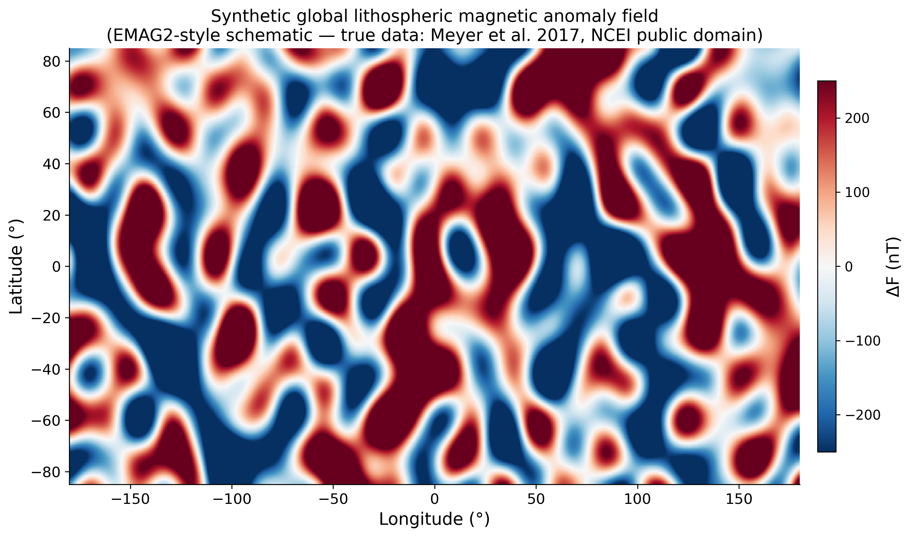
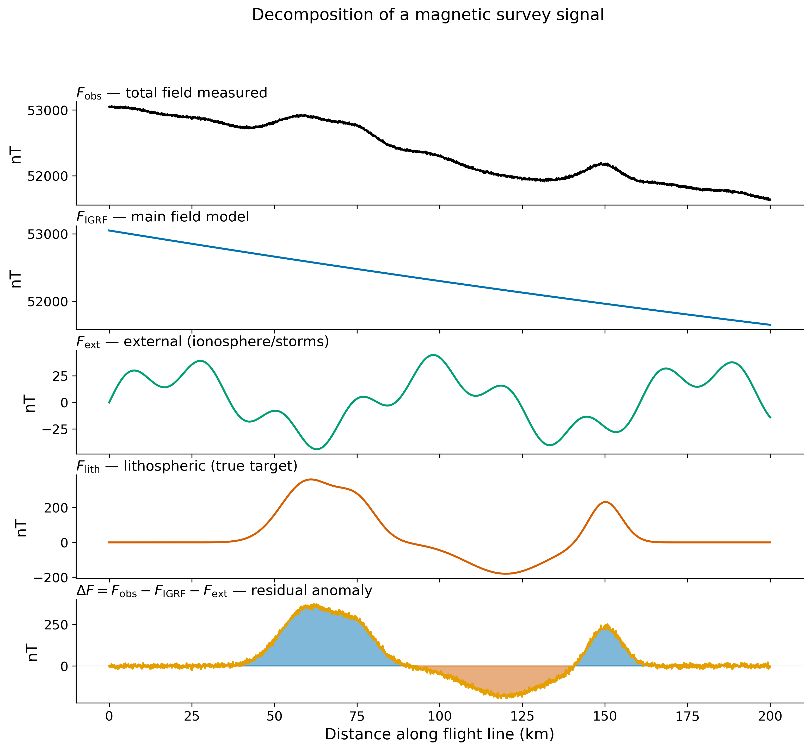
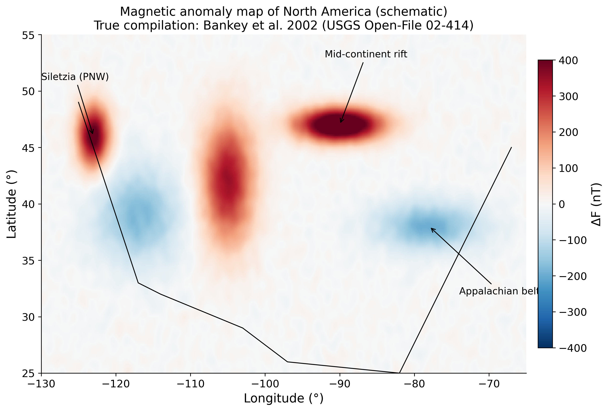
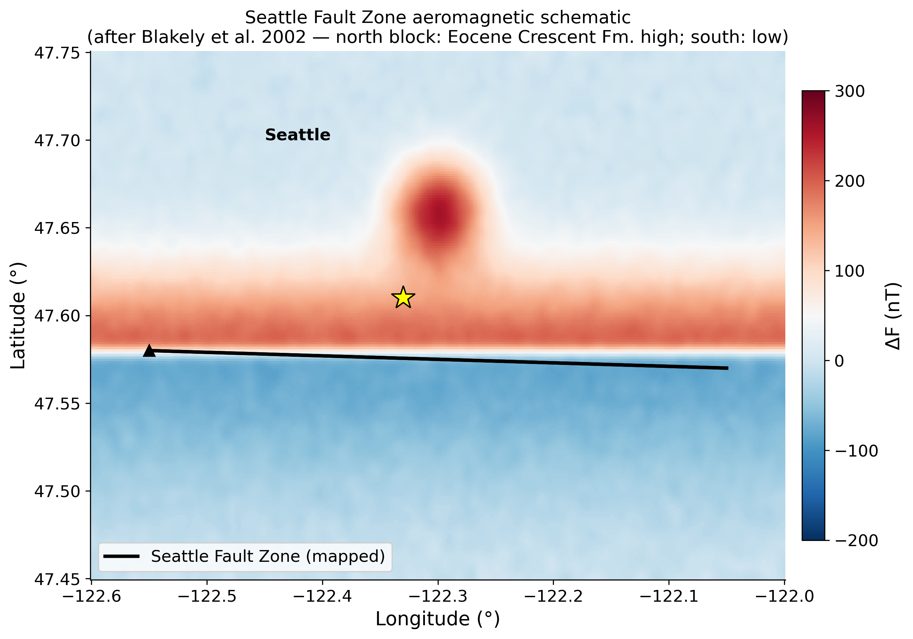

<!-- _class: title -->

# Lecture 25
## Magnetic Anomalies & Surveys
### Reading the lithosphere from a flying sensor

ESS 314 · Spring 2026 · Marine Denolle

---

## 1. The framing question

- Satellites (CHAMP, SWARM) and aircraft map the **global lithospheric anomaly field** at ~30-km resolution (EMAG2, Meyer et al. 2017 — NCEI public domain).
- The same physics — a magnetised body distorts the regional field — works at the **continent**, **basin**, and **buried-fault** scales.
- *How do we go from a flight-line measurement back to the body that made it?*

*Read more → [Lecture 25 §1](../lectures/25_magnetic_anomalies.html#1-the-framing-question)*

---

## Learning objectives

By the end of today, students will be able to:

1. Decompose a total-field measurement into **main, external, and lithospheric** components.
2. **Forward-model** the magnetic anomaly of a buried dipole and predict its **shape, sign, and skewness** with latitude.
3. Apply the **half-width depth rule** to estimate source depth from an anomaly profile.
4. Use an **ensemble forward model** to bracket the **non-uniqueness** of magnetic inversion.
5. Read the **Seattle Fault Zone aeromagnetic anomaly** as an applied earthquake-hazard problem.

---

## 2. Decomposing a magnetic measurement

$$F_{\rm obs} = F_{\rm IGRF} + F_{\rm lith} + F_{\rm ext}$$

- $F_{\rm IGRF}$ — IGRF main-field model (core dynamo).
- $F_{\rm ext}$ — ionospheric & magnetospheric variations (corrected with base stations).
- $\Delta F = F_{\rm obs} - F_{\rm IGRF} - F_{\rm ext}$ → the **lithospheric** signal we want.

*Read more → [Lecture 25 §2](../lectures/25_magnetic_anomalies.html#2-decomposing-a-magnetic-measurement)*

---

## 3. Forward model — a buried dipole

- A compact magnetised body acts (at distance ≳ 3 body-radii) as a **dipole** with moment $\mathbf{m} = M V$.
- The total-field anomaly $\Delta F$ depends on **(i)** source geometry, **(ii)** magnetisation direction, and **(iii)** the regional field direction.
- Shape changes with **latitude**: a body at the equator yields a *single negative lobe*; at the pole, a *single positive lobe*; mid-latitudes show a **dipolar pair**.

*Read more → [Lecture 25 §3](../lectures/25_magnetic_anomalies.html#3-the-forward-problem)*

---

## 3b. Reduction-to-the-pole

- **RTP** is an FFT operator that re-projects $\Delta F$ as if the source were under a vertical inducing field.
- Removes the **latitude-dependent skew**, so the anomaly sits **directly over** its source.
- Standard pre-processing step before interpretation at any scale.

*Read more → [Lecture 25 §3b](../lectures/25_magnetic_anomalies.html#3b-reduction-to-the-pole-rtp)*

---

## 4. The half-width depth rule

For a buried sphere (or 2-D vertical line) of depth $z$:

$$\boxed{\;z \approx 0.65 \cdot W_{1/2}\;}$$

where $W_{1/2}$ is the **anomaly half-width** at half-maximum.

- A 50-km wide anomaly → source ~32 km deep — that puts it in the **lower crust / Moho**.
- A 2-km wide anomaly → source ~1.3 km deep — **upper-crustal intrusion or fault block**.

*Read more → [Lecture 25 §4](../lectures/25_magnetic_anomalies.html#4-the-half-width-rule-an-inversion-shortcut)*

---

## 5. Ensemble forward modelling

- One observed profile is consistent with **many** $(z, M, V)$ combinations — the inversion is fundamentally **non-unique**.
- Strategy: forward-model an **ensemble** of plausible sources, keep those that match the data within noise, report the **range of acceptable depths/moments**.
- This is the same Bayesian logic we used for earthquake location (L14) and gravity (L20).

*Read more → [Lecture 25 §5](../lectures/25_magnetic_anomalies.html#5-the-inverse-problem-ensembles-not-point-estimates)*

---

## 6. The induced/remanent ambiguity

- A high anomaly can be **(a)** an induced response of high-$\chi$ rock to today's field, **OR** **(b)** a strong remanent moment frozen in at an earlier epoch — *possibly with reversed polarity*.
- The Königsberger ratio $Q$ (Lecture 24) decides which.
- Field discrimination tools: paired **susceptibility map** + **anomaly map**, or rock samples with both $\chi$ and $M_r$ measured.

*Read more → [Lecture 25 §6](../lectures/25_magnetic_anomalies.html#6-the-induced-remanent-ambiguity)*

---

## 7.1 Continent scale — North America

- USGS NAM compilation (Bankey et al. 2002) reveals:
  - **Mid-continent rift** (Lake Superior): a 1.1 Ga failed rift carrying ~600 nT highs.
  - **Appalachian belt**: long-wavelength low from Grenvillian basement.
  - **Siletzia** (PNW Coast Ranges): a strong positive anomaly from Eocene oceanic plateau basalts.

*Read more → [Lecture 25 §7-1](../lectures/25_magnetic_anomalies.html#71-continent-scale)*

---

## 7.2 Basin/fault scale — Seattle Fault Zone

- Blakely et al. (2002) used **low-altitude aeromagnetic** flights to map the Seattle Fault Zone under the Puget Lowland.
- High-magnetisation Eocene Crescent Fm. (north block) abuts low-magnetisation Tertiary sediments (south) across the fault.
- The aeromagnetic gradient is the **best map** of an active fault that nowhere reaches the surface.

*Read more → [Lecture 25 §7-2](../lectures/25_magnetic_anomalies.html#72-basin-and-fault-scale)*

---

## 7.3 Three-scale summary

| Scale | Wavelength | Source depth | Example |
|---|---|---|---|
| **Global** | 1000s of km | crust + upper mantle | EMAG2, satellite |
| **Regional / continent** | 100s of km | mid-to-lower crust | USGS NAM |
| **Local / fault** | 1–10 km | upper-crustal blocks | Seattle Fault Zone |

The **same physics** ties all three — only the resolving wavelength differs.

---

## 8. Research Horizon

- **Magnetic gradiometry on UAVs** — sub-meter resolution for archaeology, UXO, mineral exploration.
- **Joint gravity-magnetic-seismic inversion** with ML priors — pushing past the inherent non-uniqueness.
- **Continuous monitoring** of volcanic edifices: magnetisation drops sharply through $T_C$, so a heating intrusion reduces $\Delta F$ over time.

*Read more → [Lecture 25 §8](../lectures/25_magnetic_anomalies.html#8-research-horizon)*

---

## 9. AI Literacy — the latitude trap

- LLMs frequently quote the half-width rule **without** warning that it requires **RTP first** at mid-to-low latitudes.
- A skewed anomaly will give a **biased depth estimate** if naïvely fit.
- Always ask: *"At what magnetic latitude was this measurement made, and has it been reduced to the pole?"*

*Read more → [Lecture 25 §9](../lectures/25_magnetic_anomalies.html#9-ai-literacy)*

---

## 10. Concept check

1. An anomaly profile has $W_{1/2} = 8$ km. Estimate the source depth.
2. You measure a +400 nT high near Bremerton. Could it be a remanent low-polarity body? How would you tell?
3. Why does the Mid-continent rift show up so strongly on a magnetic map but barely on topography?

*Read more → [Lecture 25 §10](../lectures/25_magnetic_anomalies.html#10-concept-checks)*

---

## 11. Looking ahead

- **Lecture 26** — Heat and geodynamics: from radiogenic heat production to mantle convection driving the plate motions we have just measured magnetically.
- The lithospheric blocks whose anomalies we mapped today are the **plates** that the next module sets in motion.

*Read more → [Lecture 26 — Heat and Geodynamics](../lectures/25_heat_geodynamics.html)*

---

<!-- _class: title -->

# Questions?

**Lecture page:** [25_magnetic_anomalies](../lectures/25_magnetic_anomalies.html)
**Reading:** Blakely 1995 (*Potential Theory*) Chs. 7–11; Blakely et al. 2002 (*Bulletin of the SSA*).
