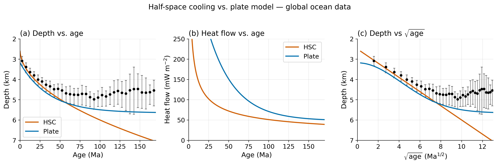
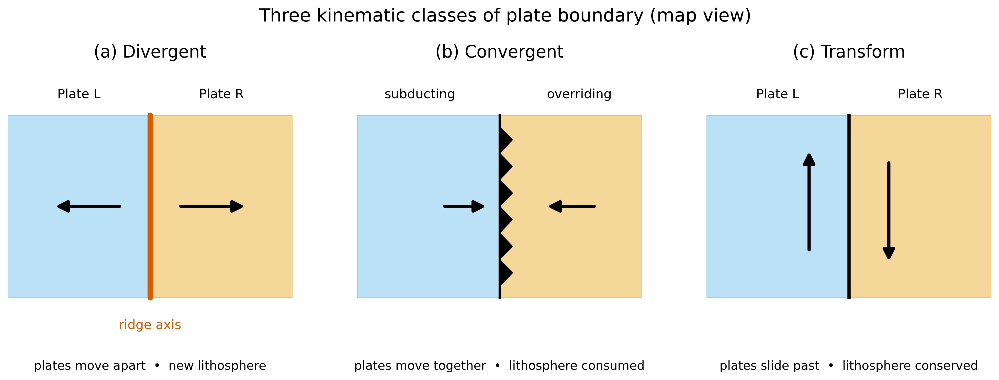
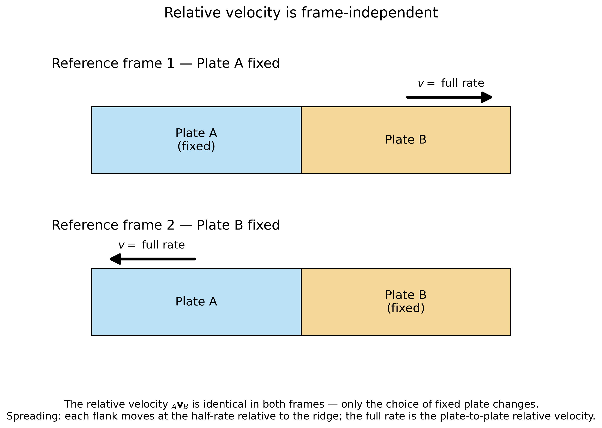
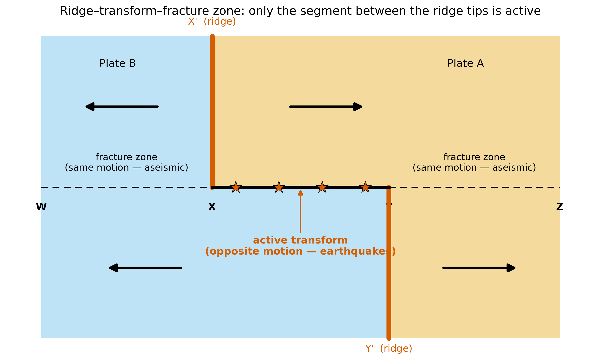
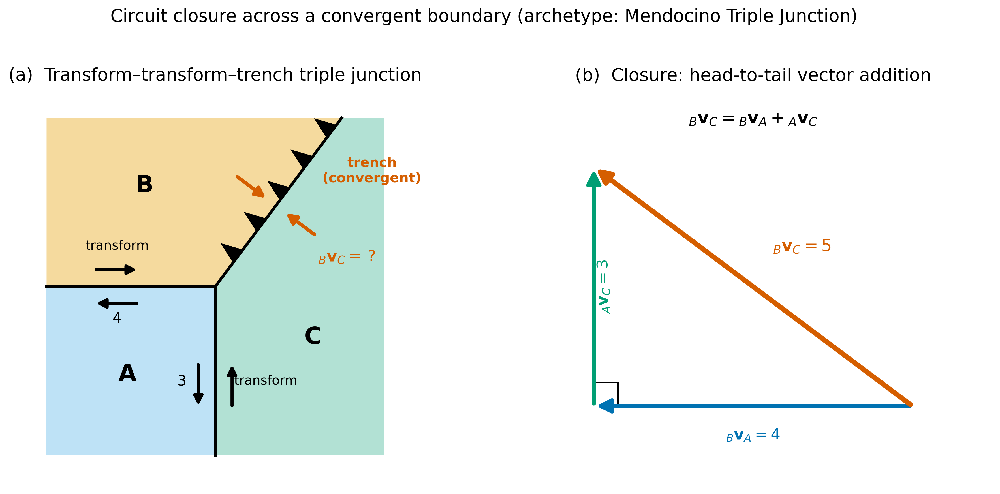

<!-- _class: lead -->
<!-- _paginate: false -->
<!-- _footer: "" -->

# Lithosphere: Oceanic vs. Continental

### ESS 314 · Geophysics · Lecture 26
#### with plate-boundary kinematics

Marine Denolle — University of Washington

---

## By the end of this lecture

- **Derive** the half-space cooling model and predict bathymetry and heat flow from seafloor age
- **Identify** the five definitions of the lithosphere base — and why they disagree
- **Build** the oceanic vs. continental comparison across eleven attributes
- **Classify** plate boundaries and balance plate-motion vectors with circuit closure

---

## What *is* the lithosphere?

- A rigid outer shell — but where does it *end*?
- Seismic, thermal, elastic, mechanical, chemical definitions
- Under oceans they agree; under old cratons they differ by **200 km**
- Module 7 uses **every method in the course at once**

> *What do we mean by "the lithosphere," and why does the answer change with the observable we use?*

---

## Oceanic lithosphere = a cooling boundary layer

- Hot mantle rises at the ridge, cools as it spreads away
- Cold layer thickens with age, $\propto \sqrt{\kappa t}$
- **Mechanical** boundary layer ($\sim 600^\circ$C) vs **thermal** ($\sim 1300^\circ$C)
- The gap between them is *why* "lithosphere" is ambiguous

---

## Key equations — half-space cooling

$$ T(z,t) = T_s + (T_m - T_s)\,\operatorname{erf}\!\left(\frac{z}{2\sqrt{\kappa t}}\right) $$

$$ d(t) \approx 2500 + 350\sqrt{t} \quad (\text{m},\ t \text{ in Ma}) \qquad q(t) = \frac{k\,(T_m - T_s)}{\sqrt{\pi \kappa t}} $$

- Bathymetry **deepens as** $\sqrt{t}$; heat flow **decays as** $1/\sqrt{t}$

---

## HSC vs. the plate model

Takeaway — HSC fits young seafloor; the **plate model** is needed past ~70 Ma, where depth and heat flow flatten.

---

## The lithosphere is *not one thing*

Takeaway — Under cratons, four "lithosphere bases" disagree by **~200 km**. The base is a *behaviour*, not a surface.

---

## Real data is one `xarray` call away

Takeaway — Müller/Seton age grid — inspect metadata first, plot, **cite the data**.

---

## Oceanic vs. continental: structure

Takeaway — Oceanic: thin, mafic, sharp ~11 km Moho. Continental: thick, felsic, gradational ~40 km Moho.

---

## The comparison in one breath

- **Oceanic:** young, homogeneous, dense → *recycled*
- **Continental:** ancient, heterogeneous, buoyant → *preserved*
- Density **and** chemistry decide who subducts
- Eleven attributes, one story: **conveyor vs. raft**

---

## Three kinematic classes of boundary

Takeaway — Divergent / convergent / transform — set entirely by the **relative-velocity vector**.

---

## Relative velocity is frame-independent

Takeaway — Fix either plate — $_A\mathbf{v}_B$ is the invariant. Watch **half-rate vs. full-rate** for spreading.

---

## Transform faults vs. fracture zones

Takeaway — Only the segment **between ridge tips** is active. Slip sense is *opposite* to the ridge offset.

---

## Circuit closure recovers the unknown

Takeaway — Rigid plates close the loop: $_A\mathbf{v}_B + {}_B\mathbf{v}_C + {}_C\mathbf{v}_A = \mathbf{0}$. (Polarity is *not* fixed by kinematics.)

---

## You are sitting on Siletzia

Takeaway — An accreted Eocene oceanic plateau — gravity high + magnetic stripes — that shapes Puget Lowland hazard.

---

## AI literacy — grade the derivation

- Prompt an AI to derive the HSC bathymetry model from the heat equation
- **Check:** boundary conditions · isostasy · the $\sqrt{t}$ prefactor · the 70-Ma limit
- A *plausible* derivation can be wrong on any of these
- **An AI is a reasoning partner, not an oracle**

---

## Concept check

1. HSC ocean depth at $t = 25$ Ma? Surface heat flow at the same age?
2. Why do four "lithosphere bases" disagree beneath a craton?
3. Classify a boundary whose relative velocity makes $20^\circ$ with the strike.
4. Confirm circuit closure for the 3-4-5 triangle of the triple junction.

*Worked vector algebra: `notebooks/plate_motion_vectors.ipynb`*

---

<!-- _class: lead -->
<!-- _footer: "" -->

## Next: Ridges and Rifts (L27)

where the oceanic lithosphere of this lecture is **born**
