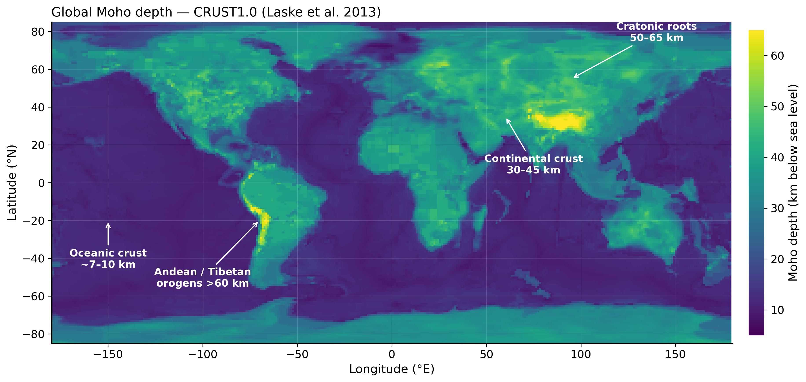
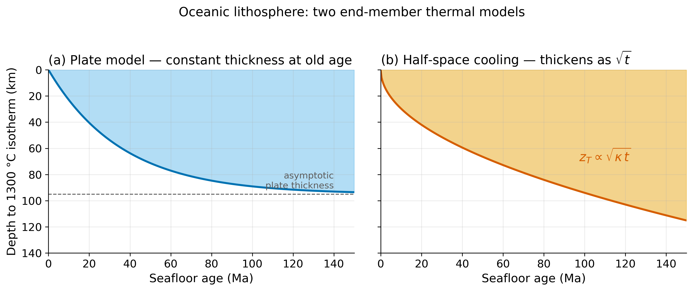
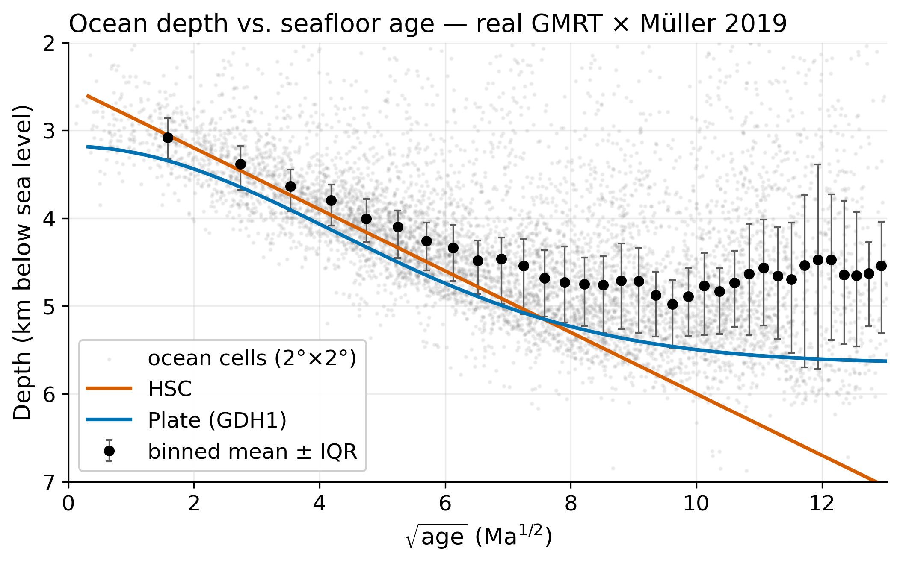
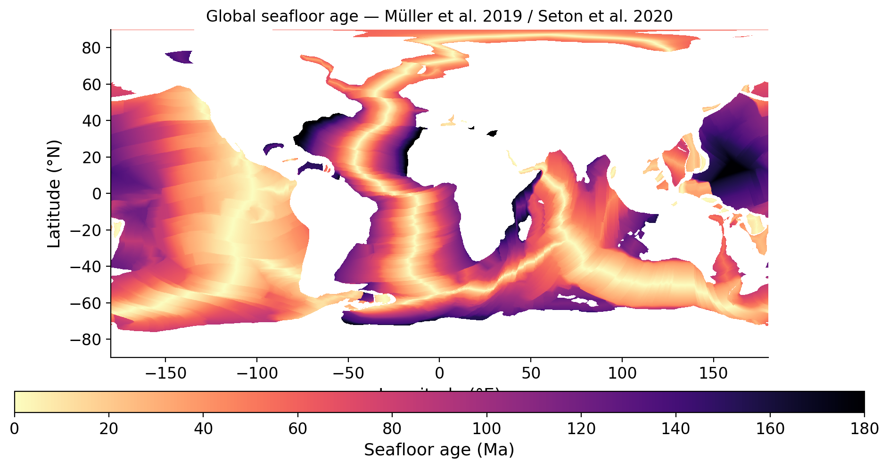
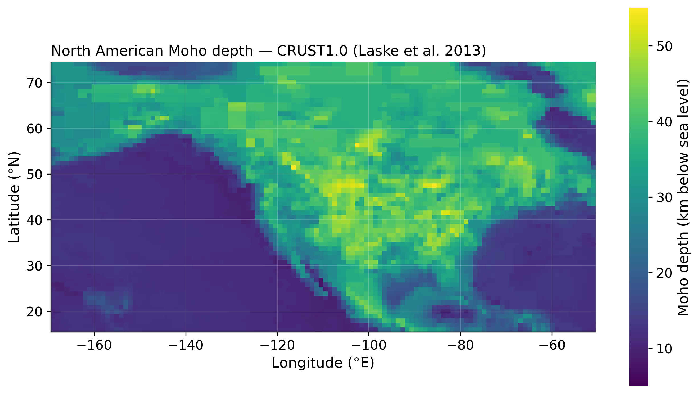
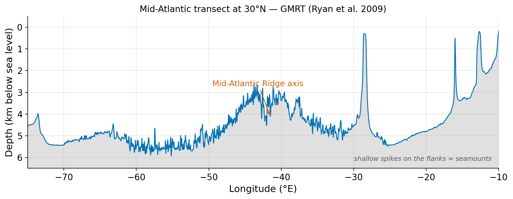
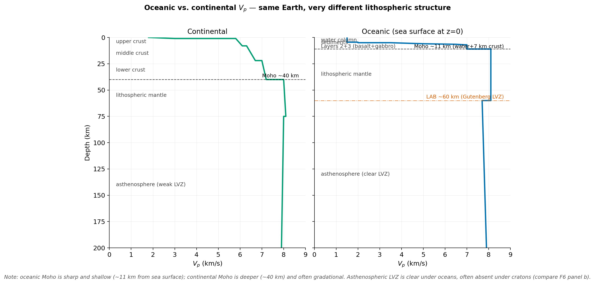
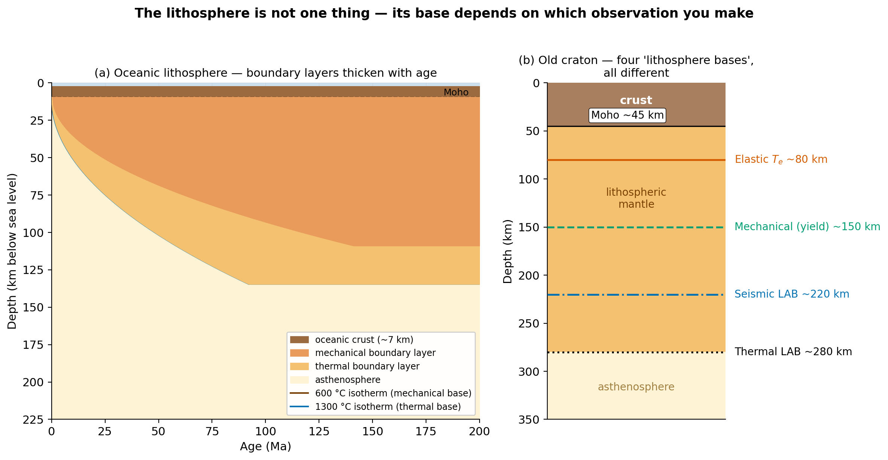
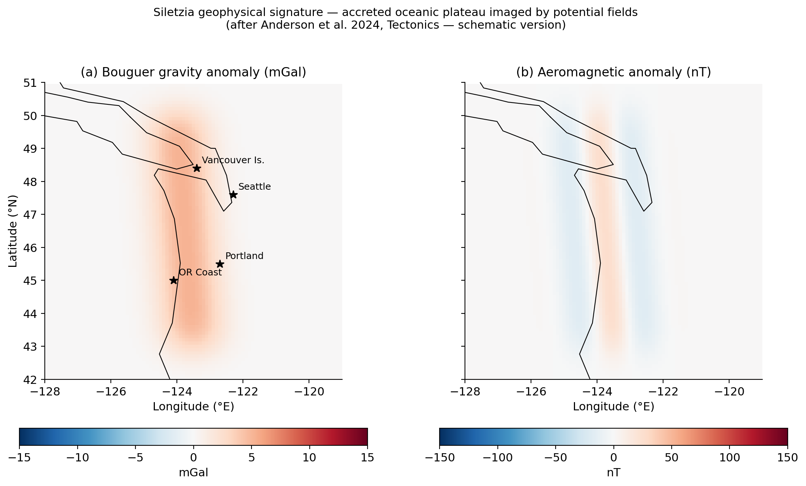

<!-- _class: title-slide -->

# Lithosphere: Oceanic vs. Continental

### ESS 314 — Lecture 26

#### Module 7: Tectonics, Lithosphere, and the Cooling Earth

University of Washington · Earth & Space Sciences

---

<!-- _class: fig-full -->

# A planet of two crusts



**CRUST1.0 Moho depth (Laske et al. 2013)** — the single map that frames the whole lecture: oceanic crust ~7–10 km, continental crust 30–45 km, cratonic and orogenic roots >55 km. *Same data, two regimes.*

---

## By the end of this lecture, you will be able to…

- Derive the **half-space cooling (HSC) model** of oceanic lithosphere from the 1D heat equation and predict bathymetry and heat flow as a function of age.
- Identify the **five definitions of the lithosphere base** — mechanical, thermal, seismic, elastic, chemical — and explain why they disagree under cratons.
- **Download, plot, and interpret** open geophysical datasets (Müller seafloor age, ETOPO1 bathymetry, CRUST1.0 Moho) using a reproducible Python workflow.
- Construct a side-by-side **eleven-attribute comparison** of oceanic and continental lithosphere.

---

## The geoscientific question

> *What do we mean by "the lithosphere," and why does the answer change depending on which observable we use?*

- Ask a seismologist: one answer.
- Ask a flexural modeler: a different answer.
- Ask a heat-flow analyst: a third.
- Under oceans they mostly agree.
- **Under old cratons they can be 50 km apart.**

The rest of this lecture is built around resolving — or not resolving — this ambiguity.

---

## Two boundary layers, not one

- **Mechanical boundary layer:** lithosphere as the cold, *strong* outer shell that cannot creep on tectonic timescales. Roughly bounded by the $600\,^\circ\mathrm{C}$ isotherm.
- **Thermal boundary layer:** lithosphere as the part of the mantle where conduction dominates over convection. Roughly bounded by the $1300\,^\circ\mathrm{C}$ isotherm.
- Between the two: rocks conduct heat like a solid but creep like a fluid.

This is the conceptual hinge of the lecture. The two definitions are real, and they disagree.

---

## Governing equation: half-space cooling

Boundary conditions: $T(0,t) = T_s$, $T(z, 0) = T_m$, $T(\infty, t) = T_m$.

$$
\frac{\partial T}{\partial t} = \kappa \frac{\partial^2 T}{\partial z^2}
$$

$$
T(z, t) = T_s + (T_m - T_s)\, \operatorname{erf}\!\left( \frac{z}{2 \sqrt{\kappa t}} \right)
$$

Thermal boundary layer thickness grows as $\sqrt{\kappa t}$.

---

## Bathymetry and heat flow

By Airy isostasy:

$$
d(t) = d_0 + \frac{2\, \rho_m\, \alpha\, (T_m - T_s)}{\rho_m - \rho_w} \sqrt{\frac{\kappa t}{\pi}}
$$

Numerical form:
$$d(t) \approx 2500 + 350\sqrt{t}\ \text{m, } t \text{ in Ma}$$

From Fourier's law:
$$q(t) = \frac{k\, (T_m - T_s)}{\sqrt{\pi \kappa t}}$$

Both: $\sqrt{t}$ and $1/\sqrt{t}$ dependence. One of the cleanest predictions in geophysics.

---

## Half-space cooling vs. plate model



HSC: lithosphere thickens forever. **Plate model:** finite $L_p \approx 95$ km.

---

## Data: depth vs. age



Past **~70 Ma**, HSC overpredicts subsidence — plate model fits better.

---

<!-- _class: section -->

# §4 — Working With Real Data: Code Block A (seafloor age)

```python
import xarray as xr
url = ("https://www.earthbyte.org/webdav/ftp/Data_Collections/"
       "Muller_etal_2019_Tectonics/Muller_etal_2019_Agegrids/"
       "Muller_etal_2019_Tectonics_v2.0_netCDF/"
       "Muller_etal_2019_Tectonics_v2.0_AgeGrid-0.nc")
ds = xr.open_dataset(url)
print(ds)                  # ALWAYS inspect first
ds["z"].plot(cmap="magma_r", vmin=0, vmax=180)
```



- Cite Seton et al. 2020, G-Cubed
- `xarray` reads netCDF directly from URL

---

## Code Block B — CRUST1.0 Moho

```python
import numpy as np
moho = np.loadtxt("xyzcoords.moho.txt")
moho_grid = moho[:, 2].reshape((180, 360))
plt.imshow(moho_grid, extent=[-180, 180, -90, 90],
           cmap="viridis", vmin=5, vmax=60)
```



- Cite Laske et al. 2013, EGU
- 1° XYZ ASCII — small, inspect-friendly

---

## Code Block C — Atlantic bathymetric transect

```python
import pygmt, numpy as np
points = np.column_stack([np.linspace(-75, -10, 500),
                          np.full(500, 30.0)])
track = pygmt.grdtrack(points=points, grid="@earth_relief_05m")
plt.plot(track[:,0], track["depth_m"]/1000)
plt.ylim(6, -1)    # NEVER invert_yaxis — set_ylim instead
```



ETOPO1 / NOAA NGDC — virtual GMT dataset.

---

<!-- _class: section -->

# §6 — Comparison Matrix
## Predict, then reveal. Three beats.

---

## Beat A — Composition, density, subduction (predict)

**Before the reveal, predict in your notebook:**

1. Dominant rock type — oceanic? continental?
2. Which lithosphere is denser?
3. Which subducts? Which doesn't?
4. Sketch a density profile for each, surface to 250 km.

**Five minutes. Write it down.**

---

## Beat A — Reveal

| Attribute | Oceanic | Continental |
|-----------|---------|-------------|
| Composition (bulk) | **mafic** (basalt + gabbro) | **felsic-to-intermediate** |
| Crustal layering | Layer 1 sed, 2 basalt/dyke, 3 gabbro | Upper, middle, lower crust |
| Density | $\rho_c \sim 2.9$, $\rho_m \sim 3.3$ g/cm³ | $\rho_c \sim 2.7$, $\rho_m \sim 3.2$–$3.3$ |

**The subtle point:** cratonic mantle is **chemically depleted** — slightly *less dense* than oceanic mantle lithosphere despite being colder. Cratons are stable because of *thermal + chemical* buoyancy.

---

## Beat B — Thickness & seismic structure (predict)

Predict $V_p(z)$, Moho depth, total lithospheric thickness for:

1. **100 Ma Pacific** seafloor
2. **Canadian Shield** craton
3. **East African Rift**

Sketch a depth–velocity panel for each. Five minutes.

---

## Beat B — Reveal: oceanic vs. continental $V_p$



Sharp shallow oceanic Moho. Deeper gradational continental Moho. **Strong LVZ under oceans; weak or absent under cratons.**

---

## Beat B — The key figure



**Four "lithosphere bases," all different.** That is the lecture's thesis.

---

## Beat C — Heat flow, gravity, magnetics, age (predict)

Predict (numbers if you can, signs if you can't):

1. Heat flow at **100 Ma Pacific** seafloor
2. Heat flow on the **Canadian Shield**
3. Bouguer gravity over a **5-km ocean basin**
4. Bouguer gravity over the **Himalayas**
5. Magnetic pattern over the **Juan de Fuca Plate**
6. Magnetic pattern over the **North American craton**

Three minutes.

---

## Beat C — Reveal

| | Oceanic | Continental |
|---|---|---|
| Heat flow | ridges $\sim 250$ mW/m²; old crust $\sim 50$ | $50$–$80$ (cratons $30$–$45$); ~40% radiogenic |
| Gravity | Bouguer high over basins; free-air ~0 over ridges | Bouguer strongly **negative** over orogens |
| Magnetics | **Vine–Matthews stripes** | Terrane-mapped, basement-controlled |
| Age range | $0$–$180$ Ma | $0$–$4000$ Ma |
| Geodynamic role | Conveyor belt — born, recycled | **Stable rafts** — resist subduction |

---

## The two-sentence summary

> *Oceanic lithosphere is **globally homogeneous and young** — its attributes are predictable from a single thermal-cooling parameter.*
>
> *Continental lithosphere is **heterogeneous and preserves Earth history** — its attributes record four billion years of accretion, deformation, and chemical evolution.*

The geodynamic role of each follows from these attribute differences.

---

## Research horizon

- **Richards et al. 2018** — modern reassessment of the global thermal models. Plate model with $T_p \sim 1330\,^\circ\mathrm{C}$, $L_p \sim 130$ km. Residuals require small-scale convection.
- **Holdt et al. 2025** — most recent global re-fit. Current best-fit plate-cooling parameters.
- **Levin et al. 2023** — the cratonic LAB is not a sharp boundary but a **layer of frozen-in scattering structures**.

> *If the LAB beneath cratons is a gradient, what does that mean for the rigid-plate assumption of plate tectonics?* — return to this in L30.

---

## PNW anchor: Siletzia



- Eocene oceanic plateau accreted to N. America $\sim 50$ Ma
- Forms the **basement of the Cascadia forearc**
- Identifiable from gravity, magnetics, and seismic
- The **Seattle Fault Zone reactivates the Siletzia–N. America suture**
- Anderson et al. 2024 — open access via USGS

---

## AI literacy — derive HSC with an AI assistant

**Prompt:**

> *Derive the half-space cooling model of seafloor bathymetry from the 1D heat equation. Show all steps. Use Airy isostasy. Show the numerical prefactor.*

**Your job: grade against this rubric.**

| Pass | Fail |
|------|------|
| Correct boundary conditions | Unphysical BCs or skipped derivation |
| Correct isostatic integral | Confuses $\alpha$ with $\rho$ |
| Numerical prefactor $\sim 350$ m·Ma$^{-1/2}$ | Drops $\pi$ or factor of 2 |
| Notes HSC fails past 70 Ma | Claims HSC is exact |

**AI is a reasoning partner, not an oracle.**

---

## Concept checks

1. **HSC numerical:** Predict ocean depth and heat flow at $t = 25$ Ma.
2. **Plate-model asymptote:** Show that the plate model reduces to HSC for $t \ll \tau$.
3. **The lithosphere is not one thing:** $T_e = 90$ km, seismic LAB at 200 km, thermal LAB at 270 km — are these inconsistent? Two sentences.
4. **Siletzia:** Predict gravity, magnetic, and heat-flow signatures from the matrix. Compare to Anderson 2024.

---

<!-- _class: closing -->

## Next time: L27 — Ridges and Rifts

We follow the oceanic lithosphere back to where it is born, and ask why continental rifts look so different from mid-ocean ridges.

#### Further reading: Richards 2018, Holdt 2025, Levin 2023, Anderson 2024
