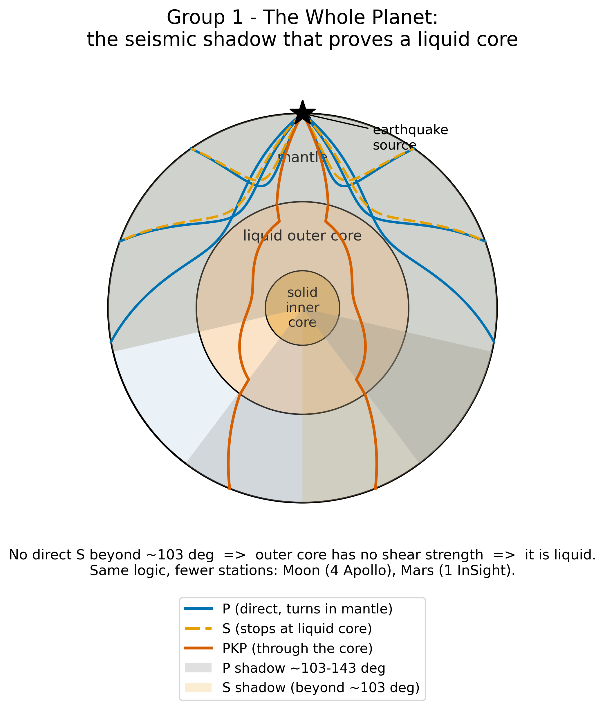
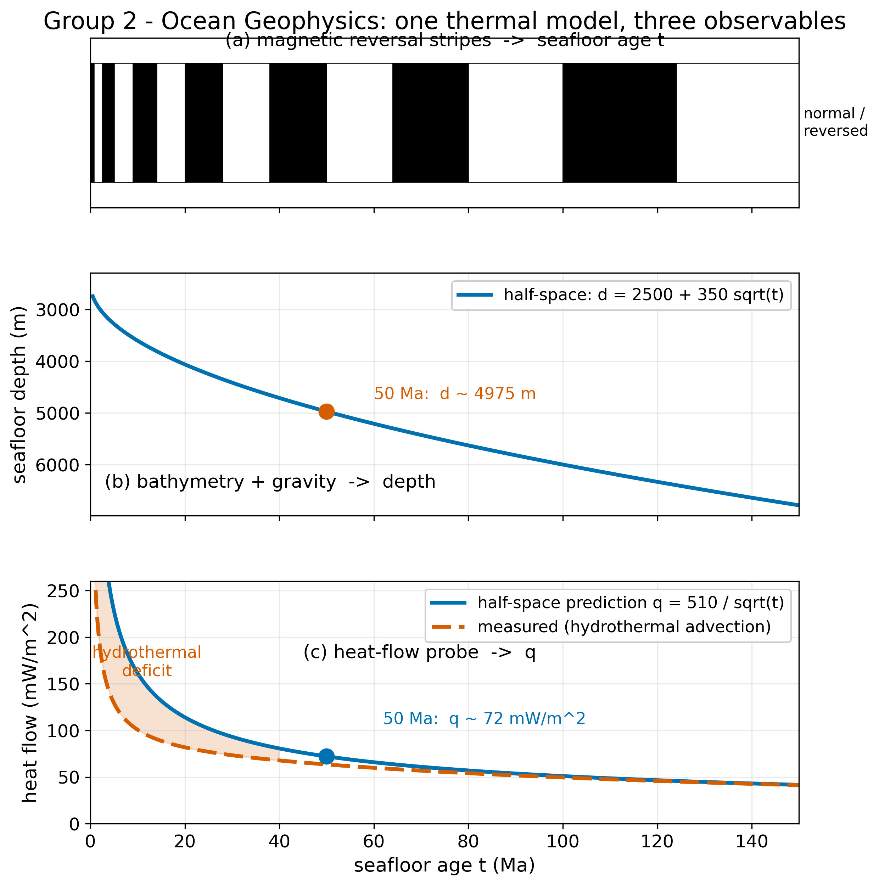
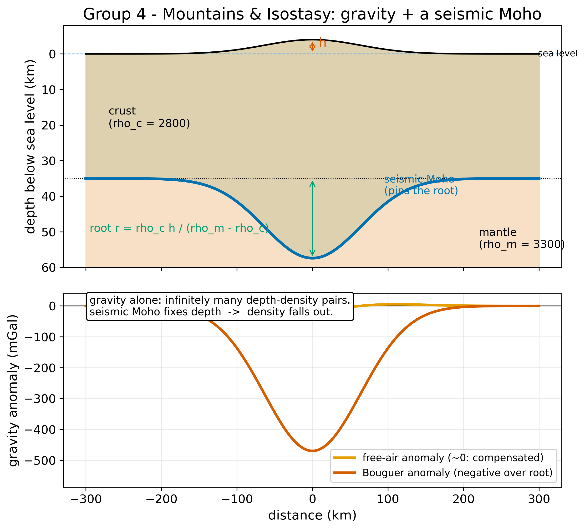
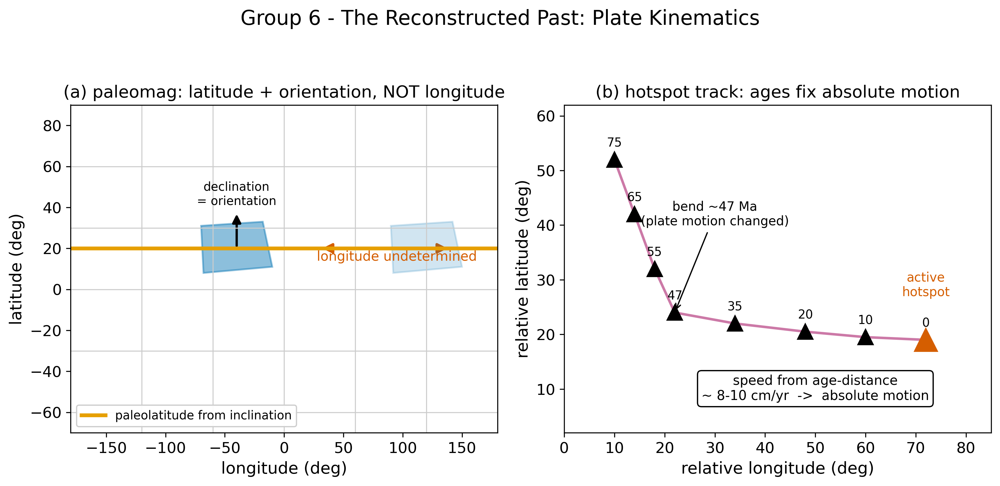
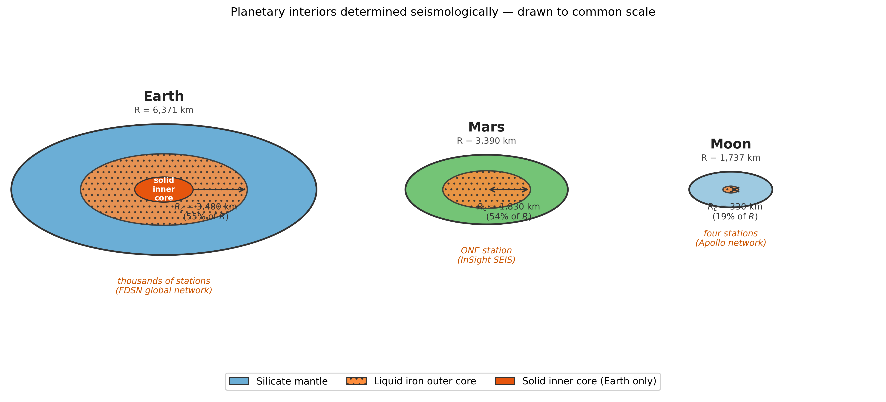

<!--
ESS 314 — Lecture 30 (Week 10): Synthesis Studio
Companion to lectures/30_synthesis.md and discussions/session_10_synthesis.md.
Built around a 20-minute active-learning review (slides 8-15).
Figures (Python-generated, copyright-clean) live in assets/figures/:
  fig_synthesis_forward_operators.png · fig_planetary_interiors.png ·
  fig_mantle_convection_engine.png · fig_l30_group1..6_*.png
Relative path from slides/ is ../assets/figures/
Compile: marp --html --allow-local-files --theme slides/ess314.css \
         --output-dir slides/ slides/lecture_30_slides.md
-->

<!-- _class: title-slide -->

# Putting It Together
## Geophysics as a Tool for Earth Structure

**ESS 314 — Introduction to Geophysics · Lecture 30**
University of Washington · Spring 2026

*Capstone synthesis and review*

*Read more → [Full lecture notes](../lectures/30_synthesis.html)*

---

## By the end of today

- **[LO-OUT-F]** Decide which method fits a given Earth question and spatial scale
- **[LO-OUT-D / E]** State a joint inverse problem; explain what each method *cannot* constrain alone
- **[LO-1]** Explain why no single observable fixes Earth structure uniquely
- **[LO-OUT-H / LO-7]** Flag the hidden assumption in a one-method claim

<!-- Activity exercises all four; closing ties to the Lab AI rubric capstone. -->

---

## Ten weeks, one question

Geophysics is the **physics of the inaccessible**. We never reach the mantle, the core, or the fault at depth.

Every method in this course did the same four things:

$$\textsf{observation} \;\rightarrow\; \textsf{model} \;\rightarrow\; \textsf{inference} \;\rightarrow\; \textsf{interpretation}$$

Today we ask the question that ties them together: confronted with a *real* piece of Earth, which methods apply — and how do we reconcile them?

---

## The big idea: one Earth, many observables

A single model $m$ → many forward operators $G_i$ → many data types. **Each method alone leaves a null space; requiring a model to fit them *all at once* shrinks it.**

*Read more → [L30 §2 Governing Physics](../lectures/30_synthesis.html#2-governing-physics)*

---

## Today you climb the scale ladder

| Scale | Size | Sample methods |
|---|---|---|
| Planetary interior | $10^3$–$10^4$ km | Body waves, modes, gravity, geodynamo |
| Whole mantle / ocean | $10^3$ km | Tomography, magnetics, heat flow |
| Lithosphere / regional | $10$–$500$ km | Gravity, isostasy, crustal seismics |
| Cryosphere / surface | $1$–$10^3$ km | Time-lapse gravity, GIA, cryoseismology |
| Deep time | — | Paleomagnetism, isochrons, hotspots |

**Same logic, different wavelength.** Each group takes one rung.

*Read more → [L30 §6 Scales of Investigation](../lectures/30_synthesis.html#6-scales-of-investigation-imaging-the-subsurface-from-planet-to-pore)*

---

## The activity — how it works

- **Six groups.** Each receives one Earth **target** and its question.
- **10 minutes:** fill the **Synthesis Card** for your target.
- **~6 minutes:** each group reports in 60 seconds; we assemble the master diagram on the board.
- The goal is not to recite facts — it is to **reconstruct the reasoning** that links data to Earth structure.

*One rule: name at least two methods, and one ambiguity their combination resolves.*

---

## The Synthesis Card

Fill these rows as a group:

1. **Methods** — the 2–4 course methods you would deploy
2. **Observable → property** — for each: what you measure → what Earth property it senses
3. **The null space** — what one method *alone* cannot tell you
4. **The joint move** — method A + method B kills *which* ambiguity? (one sentence)
5. **One number** — an order-of-magnitude estimate you can produce
6. **The one-method trap** — the hidden assumption in a single-method headline

---

## Group 1 · The Whole Planet · *planetary interior, ~10⁴ km*

**Q:** How do we know the **outer core is liquid iron** — and how would you find the core of **Mars** with one seismometer?
*On the table:* S-wave shadow · normal modes / PKIKP · mean density & moment of inertia · the geodynamo.

---

## Group 2 · Ocean Geophysics: The Spreading Seafloor · *ridge to abyssal plain, ~10³ km*

**Q:** For one patch of seafloor — **how old, how deep, and how much heat?**
*On the table:* magnetic stripes (age) · bathymetry + gravity (depth) · heat-flow probe + half-space cooling ($q \propto t^{-1/2}$).

---

## Group 3 · Cascadia Earthquake & Tsunami Hazard · *subduction margin, regional*

**Q:** What will the **next Cascadia megathrust** do to Seattle and the coast?
*On the table:* slab imaging (width $W$) · moment-tensor + paleoseismic $M_0$ · geodetic locking · GMPE shaking + shallow-water tsunami.

---

## Group 4 · Mountains, Basins & the Continents · *lithosphere, 10–500 km*

**Q:** Why is the **Tibetan Plateau (or the Cascades)** high — and what holds it up?
*On the table:* free-air vs. Bouguer gravity · Airy / Pratt isostasy · refraction for Moho depth · the Nafe–Drake bridge.

---

## Group 5 · The Cryosphere & Climate–Solid Earth Coupling · *ice sheet to mantle, regional–global*

**Q:** How do we **weigh an ice sheet and watch it melt** — and why does the solid Earth bounce back?
*On the table:* satellite gravity (mass) · glacial isostatic adjustment (rebound, viscosity) · cryoseismology · DAS on ice.

---

## Group 6 · The Reconstructed Past: Plate Kinematics · *whole planet, deep time*

**Q:** How do we **rewind the plates 100 Myr** — and why isn't the hotspot frame fixed?
*On the table:* paleomagnetism (paleolatitude, APW) · seafloor isochrons · hotspot tracks (Hawai'i–Emperor) · reconstructions.

---

## Report-out: build the diagram

As each group reports, we place its observables onto **one shared diagram** on the board:

- Each method → an **arrow** from the single Earth model
- Each "joint move" → a **link that removes an ambiguity**
- By the end, six independent targets have rebuilt **the same figure**

*Listen for: did another group's method sense a property yours missed?*

---

## Optional · grade the machine instead (LO-7)

A variant for the AI-literacy capstone:

- Each group also receives an **AI-generated answer** to its question.
- Grade it against three rubric items: **mechanism stated?**, **independent observable acknowledged?**, **limits and uncertainty present?**
- Record any failure in the **AI error log** from Lab AI.

**The standard is not whether the AI sounds authoritative — it is whether the argument survives the scrutiny you apply to a classmate.**

*Read more → [L30 §8 AI Literacy](../lectures/30_synthesis.html#8-ai-literacy-evaluating-a-synthesis-against-your-own-rubric)*

---

## What every group just did

Six different targets, six different scales — **one workflow**:

> deploy sources and receivers → measure a field at the surface → invert for the property contrast at depth → **test against an independent observable**

The misfit $\chi^2(m) = \sum_i \lVert d_i - G_i(m)\rVert^2 / \sigma_i^2$ and the null space it carries are **identical in form at every rung.** The synthesis principle is **scale-invariant**.

---

## Why it all connects: the cooling planet

The plate that cools (Group 2) is the cold boundary layer of a **convecting mantle** ($Ra \sim 10^{6}$–$10^{8} \gg Ra_c$). **Plate tectonics is its downwelling limb; hotspots (Group 6) are its upwelling limb.**

*Read more → [L30 §5 Connecting to Cascadia](../lectures/30_synthesis.html#5-connecting-to-cascadia-from-local-cooling-to-the-global-engine)*

---

## The same reasoning, other worlds

Earth: thousands of stations. The Moon: four. **Mars: one.** The reasoning is identical — convert what reaches the surface into a statement about what lies beneath.

---

## Concept Check

1. Gravity and seismic refraction both map a basement interface beneath a basin. State one property **each** senses, and why running **both** beats running either twice.

2. The mantle's Rayleigh number is $10^{6}$–$10^{8}$; critical is $\sim 10^{3}$. What does this imply about (a) how the mantle moves heat, (b) why conduction-only cooling still holds in the lithosphere?

3. Magnetics dates a seafloor site at 40 Ma; a probe returns $q = 45$ mW m$^{-2}$, about half the half-space prediction. Name one process that explains the deficit, and why bathymetry agreeing with the model makes the joint result stronger than heat flow alone.

---

## You can now read the Earth

- **Cascadia** offshore: a multi-method hazard problem — imaging, geodesy, gravity, bathymetry, combined into one fault model.
- **Puget Sound fibre**: dark telecom cable read as an urban seismic array.
- **Cascade glaciers and the ice sheets**: monitored by the same seismic and geodetic methods.

*One logic, every scale: observation → model → inference → interpretation.*

**Thank you.**

*Read more → [Full lecture notes](../lectures/30_synthesis.html) · [Studio session page](../discussions/session_10_synthesis.html)*
